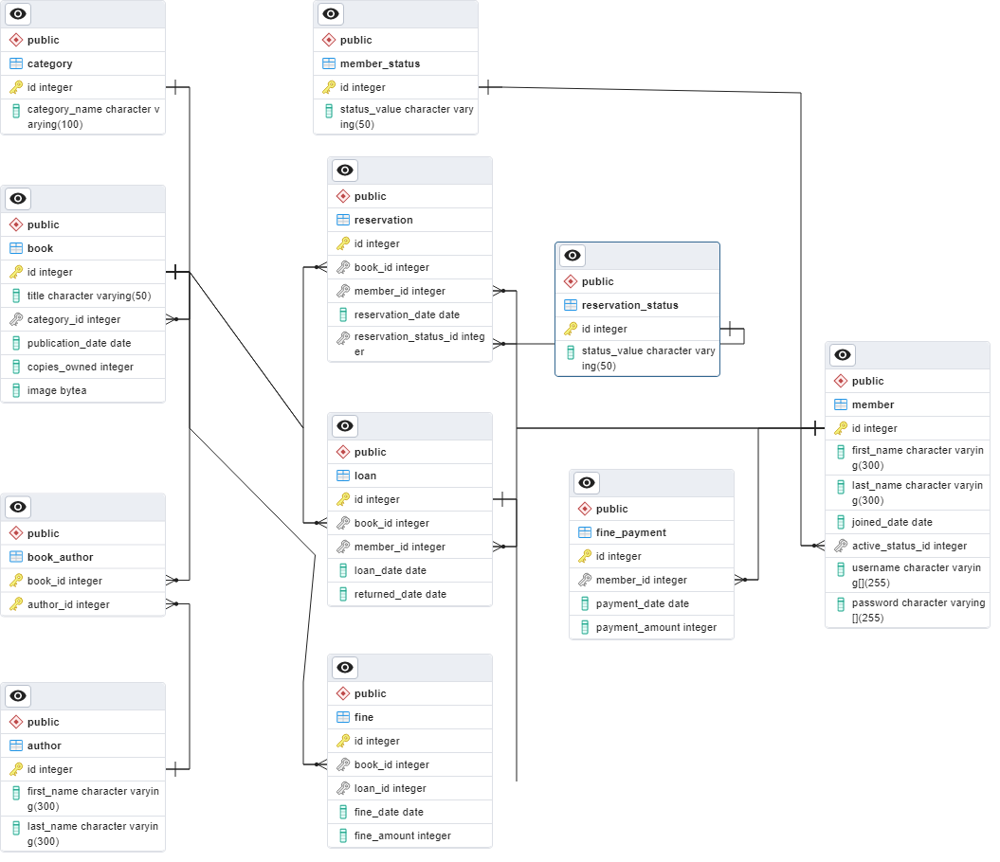
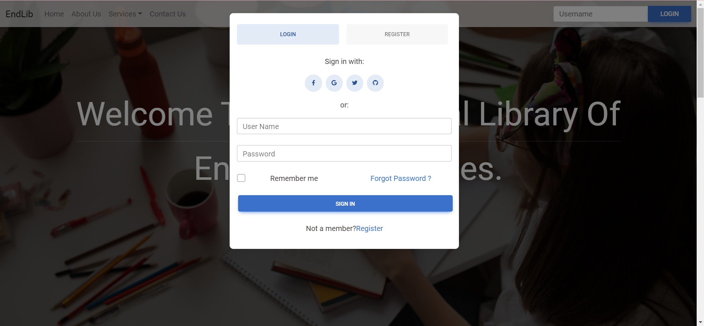
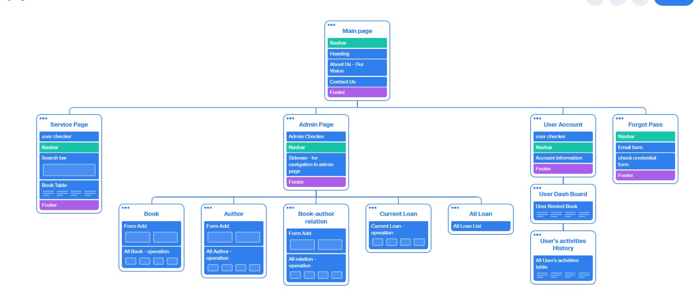
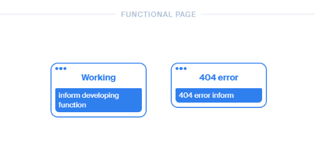
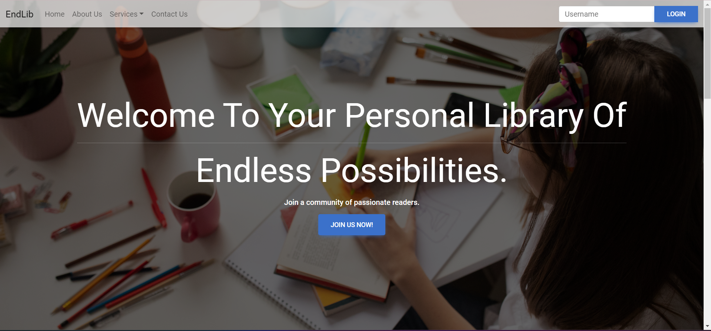

# vgupe2023_team12
## Project: Library System Management
## Members:
 1. Ngo Dinh Anh Khoa - 17557 - @17557 (Leader)
 2. Tran Quang Minh - 17061 - @17061
 3. Phi Dinh Van Toan - 17431 - @LoveLess12
 4. Nguyen Vu Doanh Khoa - 17539 - @ngvudoanhkhoa15102002
 5. Truong Van Quang - 10421050 - @Der_Entwickler
 6. Nguyen Truong Duy - 17455 - @nguyentruongduy
## Preface<a name = "preface">
  - [Acknowledgement](#acknowledgement)   
  - [1. Introduction](#introduction)
  - [2. System analysis](#analysis)
    - [2.1 Non-functional requirements](#nf-req)
    - [2.2 Functional requirements](#f-req)
  - [3. System design](#design)
    - [3.1 Database](#designDatabase)
    - [3.2 Frontend](#designFrontend)
      - [3.2.1 Architecture And Structure](#ArchitectureAndStructure)
      - [3.2.2 Dependencies and Tools](#DepAndTools)
      - [3.2.3 Design System](#DesignSystem)
      - [3.2.4 Components](#Component)
      - [3.2.5 Routing and Navigation](#RoutingAndNavigation)
      - [3.2.6 API Integration](#APIIntegration)
      - [3.2.7 Styling and CSS](#StylingAndCSS)
      - [3.2.8 Responsive Design](#ResponsiveDesign)
      - [3.2.9 Testing and Quality Assurance](#TestingAndQualityAssurance)
    - [3.3 Backend](#designBackend)
      - [3.3.1 Requirements](#requirementBackend)
      - [3.3.2 Dependencies](#dependenciesBackend)
      - [3.3.3 Architecture](#architectureBackend)
  - [4. Implementation](#implementation)
    - [4.1 Database](#implementationDatabase)
      - [4.1.1 Restore the database](#DBres)
    - [4.2 Frontend](#implementationFrontend)
      - [4.2.1 How to start the frontend server for developing?](#startFrontend)
      - [4.2.2 Functionality](#functionality)
      - [4.2.3 Work Flow](#userStory)
      - [4.2.4 Third Party Libraries](#thirdPartyLibraries)
      - [4.2.5 Integration with Backend](#integrationBackend)
      - [4.2.6 Performance Optimization](#performanceOptimization)
    - [4.3 Backend](#implementationBackend)
      - [4.3.1 Our step for creating a server](#stepBackend)
      - [4.3.2 Document](#DocBackend)
  - [5. Deployment](#deploy)
  - [6. Conclusion](#conclusion)

# ACKNOWLEDGEMENT<a name = 'acknowledgement'>
Thanks to ***Mr. Huynh Trung Hieu***, we gain lots of experiences, knowledgements to complete the project "Library Management System" successfully. Furthermore, we would like to express our deep thanks to our lecturer for giving us a chance to work together, learning new things and the most important thing is the team-work ability. We extend our gratitude towards Mr.Hieu for sincere advices, enthusiasm and creating  inspirations. 

# 1. INTRODUCTION<a name = 'introduction'>
Welcome to **EndLib** (our Library Management System), a web project designed to simplify the process of managing a library. Our system focus on managing books, loans and members.

**EndLib** is a user-friendly web-based application that allows librarians to manage the library's collections and operations with ease. It also provides a seamless experience for library members, allowing them to easily search for and borrow books, renew borrowed books, return books and  adjust their profile.

## 1.1 PROJECT AIMS & OBJECTIVES

- To create an easy-use interface, make it convenient for users to approach the system.

- Bring to users an enhance experience, make it simple for users to discover what they need. The web will also provides some options such as online bookings and suitable suggestions for increasing consumer satisfaction.

- Help library staff to have an effective management of library materials including books, novels or other resources. The system is generated in order to help the library  manager to locate and access the materials expertly. 

- The search book page includes all informations of the book such as author, title, published date or book id with an availability status for the purpose of finding book quickly.

- The system helps users to save time, instead of going to the library directly, they can  utilize the system as a fascinating tool to take the e-book which can be read and used online immediately.

- Encourage the self-learning with the expansion of knowledge provided in the variety of resources.

## 1.2 PROJECT OVERVIEW

The project Library Management System seeks to construct an effective and user-friendly software to revolutionize the way our library runs. The system helps the library staff to control and managing operations more efficiently, provide better services or informations about the library to users. Moreover, it also helps librarians to search the wanted book, rent it and return back when reading is finished. Student will benefit for a more streamlined borrowing procedure and found it as an easy way to access the materials of the library. This project improved the user experiences and activities of users when taking part in the library system such as checking status of books they rented or seeing and changing the status of the user's account. Library manager can easily to manage the users with their rented books, adding and removing books and be able to control the fine payments if the user did not return the book at a specific day. Besides that, a search tool is also developed for librarians to find books, journals or novels quickly and updated the user status for borrowing on the dashboard.  

## 1.3 PROJECT SCOPE

The project scope aims to build a clear understandings of features and functionalities, which will be include to the library management system. For the user registration, we will let users to create a new account, allow users to update their profiles, some contact details saved for admin to handle with authentication to ensure the access to the system is secure. The system will provide a form for user to register as a new memeber of the library system. Moving on, for the book management, we implement collections of books, novels or other resources, allow the library manager to control all the status of the book, from adding, removing to updating the newest informations such as author, title, published date or availability status of the book. For borrowing and return process, all the actions will be notified on the dashboard such as borrowed book, return status and of course the name of the book. Librarians will find the search book page on the main navbar of the homepage, direct users to search the book they want and take actions on it. We created a friendly interface to make it simple and efficient way to retrieve library materials, allow users to find a book easily by title or author's name, the availability status is also included to show if a specific item is available or not. For the library manager, an admin page will also be included to control and manage the renting status and the fine status of the users, adding, removing book and management of the current loan. 

# 2. SYSTEM ANALYSIS <a name = 'analysis'>
## 2.1 NON-FUNCTIONAL REQUIREMENTS <a name = 'nf-req'>
- **Scalability**: The system should be scalable to accommodate future growth in terms of the number of books, patrons, and transactions. It should be able to handle increasing loads without significant performance degradation
- **Security**: The system should provide robust security mechanisms to protect sensitive data, including personal information of patrons, book inventory, and transaction records. It should enforce access controls, authentication, and encryption to prevent unauthorized access and ensure data privacy.
- **Usability**: The system should be user-friendly, with an intuitive interface that is easy to navigate and understand. It should provide clear instructions and feedback to users, reducing the learning curve and enabling efficient usage.
- **Maintainability**: The system should be designed in a modular and well-structured manner, making it easy to maintain and modify. It should have clear documentation, code commenting, and version control practices to facilitate future enhancements and bug fixes.

## 2.2 FUNCTIONAL REQUIREMENTS <a name = 'f-req'>
- The user can register for a new account
- The user can log in
- The user can reset his/her password via email
- The user can search for a book using the book title or author name
- The user can restore the password via email
- The user can rent books
- The user can extend rend time
- The user has his/her own dashboard to check the loan
- The librarian can add, update and delete books, authors and loans via the admin dashboard

# 3. SYSTEM DESIGN <a name = 'design'>
## 3.1 Database <a name = 'designDatabase'>
### 3.1.1 Database Schema<a name = 'DatabaseSchema'>
- The database schema for the Library Management System consists of several tables that represent different entities and their relationships.
- member: Stores information about library users, including their unique ID, name, contact details, and any other relevant information.
- book: Contains details about the books available in the library, such as the book ID, title, author, publication year, genre, and other attributes.
- author: Stores information about the authors, including their ID, name, biography, and any other relevant details.
- loan: Represents the borrowings made by users, with fields like loan ID, book ID, date borrowed, due date, and return date.
- reservation: Keeps track of book reservations made by users, including reservation ID, book ID, reservation date, and status.
- fine: Responsible for storing information related to fines imposed on library users for late returns or other violations. It tracks the fines associated with specific borrowings and provides details such as the fine ID, loan ID, fine amount, fine date, and any additional notes.
- fine_paytment: Responsible for recording the payments made towards fines imposed on library users. It stores information about the fine payments, including the payment ID, payment amount, payment date, and any additional notes.
### 3.1.2 Entity Relationships<a name = 'EntityRelationships'>
- The database schema establishes relationships between the tables to ensure data integrity and efficient retrieval.
- author and book: Authors and books have a many-to-many relationship, as an author can have written multiple books, and a book can have multiple authors. This relationship is represented using an intermediary table called book_author, which contains author ID and book ID pairs.

### 3.1.3 Indexing and Perfromance<a name = 'IndexingAndPerformance'>
- To optimize the performance of the database, appropriate indexing strategies can be implemented
- Primary keys should be defined on unique ID fields, such as user ID, book ID, author ID, fine ID, loan ID, and reservation ID.
- Foreign keys should be created to establish relationships between tables, ensuring referential integrity and enabling efficient joins between related tables.
- Indexes can be added on frequently used columns, such as book title, author name, user name, ISBN, and publication year, to speed up search queries.
## 3.2 Frontend <a name ='designFrontend'>
### 3.2.1 Architecture And Structure<a name = 'ArchitectureAndStructure'>
- The front-end codebase is organized using a component-based architecture with Vue.js 3, following the Single File Component (SFC) structure. The main components or modules are organized based on their functionality and purpose.

- The front-end codebase follows a Single Page Application (SPA) architecture, providing a seamless and interactive user experience. The SPA approach allows users to navigate the website without page reloads, as the content dynamically updates within a single HTML page.

- By adopting the SPA architecture, the website delivers a fast and fluid user experience, as the content is loaded and updated dynamically, minimizing the need for full page refreshes. This architecture also enables efficient data fetching and rendering, enhancing the overall performance of the application.
### 3.2.2 Dependencies and Tools <a name = 'DepAndTools'>
The following dependencies and tools are used in the front-end development of the library management website:

- **Vue.js:** The Vue.js framework itself, providing the core functionality, including the virtual DOM, reactivity system, and event system.

- **Vue Router:** A routing library that deeply integrates with Vue.js core, enabling the creation of Single Page Applications.

- **MDB Vue UI Kit:** A pre-built UI component library that offers a collection of visually appealing and responsive UI components.

- **Vuex:** A state management pattern and library specifically designed for Vue.js applications, used for storing authentication-related data.

- **Babel and ESLint:** Tools used to control code quality and enforce coding standards.

### 3.2.3 Design System <a name = 'DesignSystem'>
The library management website follows the Material Minimal design system, an improved version of the classic Material Design. It provides a set of consistent design elements, including typography, colors, spacing, and more, to ensure a visually appealing and cohesive user interface.

### 3.2.4 Components <a name = 'Component'>
The front-end of the library management website consists of various components, it is seperated based on Function and page including:

- **Services Component:** consist of many small component that are used in different view.

- **Admin Component:** This component provides tools for administrators to manage books, authors, loans, and users. It includes functionalities for adding, updating, and removing books and other entities.

- **User Component:** This component displays the books currently loaned by a user, along with tools for returning and renewing books and viewing loan history. It also provides functionalities to manage account information.

- **Login-register component:** This component allows users to login, register for an account, and change their password. It facilitates user authentication and registration.

<!--  -->

- **Authentication components:** These components handle user credential verification and authorization for administrative functionalities.

### 3.2.5 Routing and Navigation <a name = 'RoutingAndNavigation'>
Routing and navigation in the front-end are handled by Vue Router. The website consists of multiple pages, and the routing logic is based on URL, hashes and dynamic routes. Vue Router manages the navigation between different components based on the defined routes.

### 3.2.6 API Integration <a name = 'APIIntegration'>
The front-end interacts with the backend API using the Axios library. Axios enables making HTTP requests, such as GET, POST, PUT, and DELETE, to consume the API services. The API endpoints are utilized for various functionalities, including book management, user management, and authentication. Authentication and authorization are enforced based on the API requirements.

### 3.2.7 Styling and CSS <a name = 'StylingAndCSS'>
The front-end styling of the library management website is achieved by utilizing Bootstrap and MDB Bootstrap Kit, along with some self-written CSS. The Bootstrap framework provides a responsive and mobile-first design approach, ensuring a consistent and visually pleasing UI. The CSS follows the naming conventions enforced by ESLint to maintain code quality and consistency.

### 3.2.8 Responsive Design <a name = 'ResponsiveDesign'>

The library management website is designed to be responsive, adapting to different devices and screen sizes. Bootstrap's responsive design utilities are utilized to ensure that the website displays optimally across various devices, including desktops, tablets, and mobile devices. Media queries and breakpoints are employed to apply specific styles and layout adjustments based on the screen size.

The website's responsive design aims to provide an optimal user experience by adapting the content and layout to different screen sizes. It ensures that users can easily access and interact with the website, regardless of the device they are using.

### 3.2.9 Testing and Quality Assurance <a name = 'TestingAndQualityAssurance'>
During the development of the front-end codebase, the browser's developer tools, including the developer console and vue plugin, were utilized for code inspection and debugging. These tools provided valuable insights into the behavior and performance of the website, helping identify and address any coding errors or issues.

## 3.3 Backend <a name = 'designBackend'>
### 3.3.1 Requirements <a name = 'requirementBackend'>
Requirements for **EndLib** backend:
- Book Management: Librarian/Admin can add, find, update, delete books via *admin* account
- Author Management: Librarian/Admin can add, find, update, delete authors via *admin* account
- Book-Author Relationship Management: Librarian/Admin can add, find, update, delete book-author relationships via *admin* account
- Borrowing Book: The member of **EndLib** should be able to create a new Loan base on the book ID 
- Returning Book: The member of **EndLib** should be able to update *return_dated* of a Loan base on the Loan ID 
- Extenting Loan: The member of **EndLib** should be able to update *due_date* of a Loan base on the Loan ID 
- Member Registration: Creating a new member on the **EndLib** database
- Member Authentication: The **EndLib** should support user authentication and authorization to ensure secure access to the system.
- Showing Member Loan: The member of **EndLib** should be able to know the current loan and all of the previous loan.
### 3.3.2 Dependencies <a name = 'dependenciesBackend'>
- **bcryptjs** (version 2.4.3): A library for hashing passwords securely. It allows you to hash and compare passwords, adding an extra layer of security to user authentication.

- **cors** (version 2.8.5): A middleware that enables Cross-Origin Resource Sharing (CORS) for Express applications. It allows you to control which external domains can access your API.

- **crypto** (version 1.0.1): A Node.js module that provides cryptographic functionality. It includes functions for generating secure random numbers, creating hashes, and encrypting/decrypting data.

- **dotenv** (version 16.0.3): A module that loads environment variables from a .env file into process.env. It helps you manage sensitive information, such as API keys or database credentials, without hardcoding them in your code.

- **express** (version 4.18.2): A fast and minimalist web framework for Node.js. It simplifies the process of building web applications and APIs by providing robust routing, middleware, and handling of HTTP requests and responses.

- **helmet** (version 7.0.0): A middleware that enhances security by setting various HTTP headers to protect against common web vulnerabilities, such as cross-site scripting (XSS) and clickjacking.

- **js-yaml** (version 4.1.0): A library that enables parsing and serialization of YAML (Yet Another Markup Language) files in JavaScript. It can be useful for configuration files or data exchange in a human-readable format.

- **jsonwebtoken** (version 9.0.0): A library for generating and verifying JSON Web Tokens (JWT). JWTs are commonly used for authentication and authorization in web applications.

- **nodemailer** (version 6.9.2): A module that allows you to send emails from your Node.js applications. It supports various transport methods (SMTP, sendmail, etc.) and provides a simple API for sending emails with attachments, HTML content, and more.

- **nodemon** (version 2.0.22): A development utility that automatically restarts your Node.js application whenever file changes are detected. It helps speed up the development process by eliminating the need to manually restart the server after every code modification.

- **pg** (version 8.10.0): A PostgreSQL client for Node.js. It provides a high-performance, non-blocking interface for interacting with PostgreSQL databases.

- **pg-hstore** (version 2.3.4): A module that enables Sequelize to handle PostgreSQL's hstore data type. It allows you to store key-value pairs in a single column in PostgreSQL databases.

- **sequelize** (version 6.30.0): An ORM (Object-Relational Mapping) library for Node.js. It provides an abstraction layer for interacting with relational databases, such as PostgreSQL, MySQL, and SQLite, using JavaScript objects and functions.

- **swagger-jsdoc** (version 6.2.8): A library that combines JSDoc annotations with OpenAPI (formerly known as Swagger) specifications. It allows you to generate OpenAPI documentation for your Express API based on your code comments.

- **swagger-ui-express** (version 4.6.3): A middleware that serves Swagger UI, an interactive documentation tool for OpenAPI specifications, directly from your Express application. It provides a user-friendly interface to explore and test your API endpoints.
### 3.3.3 Architecture <a name = 'architectureBackend'>
We will follow a modular architecture pattern to organize our codebase. This pattern promotes reusability, maintainability, and separation of concerns. The main components of our backend architecture include:
- **Config**: The config directory contains configuration files for our backend, such as database configuration.
- **Controllers**: The controllers handle the logic for specific API endpoints. They receive requests, process data, interact with services, and send responses.
- **Models**: The models define the structure and relationships of our application's data. We will use Sequelize to define these models and interact with the underlying database.
- **Middleware**: The middleware contains the *Authenticate Token function*, which is used to find out if the current user is admin, member or guest.
- **Routes**: The routes define the API endpoints and their corresponding controller functions. They handle incoming requests and route them to the appropriate controllers.

# 4. Implementation <a name = 'implementation'>
## 4.1 Database <a name = 'implementationDatabase'>
- **Choosing PostgreSQL:** 
- Install PostgreSQL: Download and install PostgreSQL from the official website or package manager appropriate for your operating system.
- Set up the database: Create a new database for the library management system using the PostgreSQL command-line interface or a database management tool
- **Table Creation:**
- Create the necessary tables: Use SQL commands to create the tables discussed in the system design section (e.g., member, book, author, loan, reservation, fine, fine_payment). Define appropriate data types, constraints, and relationships.
- Execute the SQL commands: Run the SQL scripts that contain the table creation statements in the PostgreSQL command-line interface or a database management tool.
- **Indexing and Performance:**
- Identify key columns: Determine the columns that require indexing based on the queries frequently executed on the tables.
- Create indexes: Use the appropriate PostgreSQL commands (e.g., CREATE INDEX) to create indexes on the selected columns.
- Monitor and optimize performance: Continuously monitor the system's performance, identify bottlenecks, and make necessary adjustments such as adding or modifying indexes, optimizing query execution plans, or tuning database configuration parameters.
- **Maintenance and Upgrades:**
- Apply patches and updates: Keep the PostgreSQL installation up to date by regularly applying patches, bug fixes, and security updates provided by the PostgreSQL community.
- Plan for database growth: Monitor the database size and performance, and plan for scaling options as the library management system grows.

## Frontend <a name ='implementationFrontend'>
### 4.2.1 How to start the frontend server for developing?<a name = 'startFrontend'>
Open in Terminal, change directory to Frontend,use 

***npm install*** *to install all the dependencies*

then 

***npm run serve*** *to run the developing server*

Please note that to access all the website the backend server with a proper database must be running before the frontend server.

### 4.2.2 Functionality <a name = 'functionality'>
<!-- List the main functionalities and features of your library management website. Describe each functionality briefly, highlighting what it does and how it benefits the users. -->
- **Login/Register**: Users can login or register for a new account. The login and register forms are displayed in a modal. The login form allows users to login with their username and password. The register form allows users to register for a new account by providing their username, email, first name, last name, and password. The register form also includes a password confirmation field to ensure that the user has entered the correct password. The register form also includes a link to the login form, allowing users to easily switch between the login and register forms. The login and register forms are also accessible from the home page.

- **User Authentication**: The website supports user authentication and authorization to ensure secure access to the system. The authentication process is handled by the backend API, which returns an access token upon successful authentication. The access token is stored in the browser's local storage and is used to authenticate the user for subsequent requests. The access token is also used to determine the user's role, which is used for authorization purposes. The access token is removed from the local storage upon logout.

- **User Authorization**: The website supports user authorization to ensure that users can only access functionalities that they are authorized to use. The user's role is determined based on the access token, which is stored in the browser's local storage. The user's role is used to determine whether the user is authorized to access certain functionalities. For example, only administrators are authorized to access the admin dashboard, which allows them to manage books, authors, loans, and users. The user's role is also used to determine whether the user is authorized to access certain routes. For example, only authenticated users are authorized to access the user dashboard, which allows them to manage their account and view their loan history.

- **User Dashboard**: The user dashboard displays the books currently loaned by the user, along with tools for returning and renewing books and viewing loan history. It also provides functionalities to manage account information. The user dashboard is only accessible to authenticated users, and only the user who is currently logged in can access their own dashboard. The user dashboard is also accessible from the main navigation bar.

- **Admin Dashboard**: The admin dashboard provides tools for administrators to manage books, authors, loans, and users. It includes functionalities for adding, updating, and removing books and other entities. The admin dashboard is only accessible to administrators, and only administrators can access the admin dashboard. The admin dashboard is also accessible from the main navigation bar.

### 4.2.3 Work Flow <a name = 'userStory'>

- **Log In/Register For A New Account**: A modal will be popped up when users hit the login button - or press enter on the input field at top right corner of the home page. 
  - Login:
    - a note will be shown if the user input the wrong password or username
  - Register:
    - a note will be shown if the user input the username that already existed
    - a note will be shown if the user input the password that is too short (< 6 characters) or the repeat password filed does not match the password field
    - a note will be shown if the user input the email does not valid

- **Log Out**: Users can log out by clicking the logout button on the main navigation bar. This will remove the access token from the local storage and redirect the user to the home page.

- **Authorization checking on Frontend layer**
  - When user come to the service page or User's information page without logging in, the login modal will shown up automatically and auto re-show up until user logged in or comeback to a home page.
  - When user come to the admin page without logging in or logging in as a admin, they will be redirect to the home page.

- **User's Information**: Users can see edit their profile, Username, Email, First Name, Last Name (password change is not included here)

- **Changing Password**: Users can change their password only by the *Forgot password* function, access on the login modal or on the user information page.
  - after they input the email, a code will be sent to the inputted email
  - a note will be shown if the user input the wrong code
 
- **Search Book Functionality**: The *Service Page* includes a list of books with the availability status so that users can know if it's rentable or not. It also contains a search bar for users to find exactly the book they need, filtered by the title or the author of that book. 

- **Re-due - Return Book**: On the *User Dashboard* page, users can see the list of books they have rented (in the service page) and the due date of those books. They can choose to return the book or re-due the book if they want to extend the due date.
  - User can only return the book unless the fee is 0
  - The fee will be calculated automatically when the book is overdue or user redue the book.
  - User can only pay the fee through librarian.
  
  
- **Admin Page Construction**:
  - This page contains adding books area, followed by title, category, copies owned, description, published date and image and admin can modify all the informations about the book that had been existed. 
  - The name of the authors and their IDs can also be changed and the author IDs are related with the book IDs through a relationship list.
  - Moreover, loans are managed by adjusting book IDs, member username, returned date, due date. loan date and the fees. In here have the function to remove the fee of the loan.

### 4.2.4 Third Party Libraries <a name = 'thirdPartyLibraries'>
- **mitt**: A tiny event emitter library
  - **Why**: We use this library to create a global event bus for our application. This event bus is used to emit and listen to events across different components. It allows us to easily communicate between multiple components without having to pass props or use Vuex. In Vuejs 3, the global event bus is no longer available & the $emit function can only emit to a single component, so we use this library to create our own event bus.
  - **How**: We create a new instance of the event bus in the eventBus.js file and export it as a plugin. This allows us to use the event bus in any component by importing the plugin. We can then use the event bus to emit and listen to events across different components.
- **vuex-persistedstate**: Persist Vuex state with localStorage
  - **Why**: We use this library to persist the Vuex state in localStorage. This allows us to persist the user's authentication state across page refreshes and browser sessions. It also allows us to persist the user's authentication state across different tabs in the same browser session.
  - **How**: We create a new instance of the vuex-persistedstate plugin in the store.js file and pass in the Vuex store as an argument. This allows us to persist the Vuex state in localStorage. We can then use the persisted state in any component by importing the plugin.

### 4.2.5 Integration with Backend <a name="integrationBackend">

The front-end of the library management website seamlessly integrates with the backend to enable various functionalities and data operations. The integration primarily relies on RESTful API communication between the front-end and the backend server. The following steps outline the integration process:

- 1. **API Communication**: The front-end interacts with the backend using HTTP requests to consume the RESTful API endpoints. These requests are sent using the Axios library, a popular HTTP client for JavaScript applications.

- 2. **Endpoint Authentication**: To ensure secure access to the backend resources, the front-end includes authentication mechanisms. User authentication tokens or session cookies are typically sent with each request to authenticate and authorize the user's actions.

- 3. **API Endpoint Usage**: The front-end interacts with different API endpoints based on the desired functionality. For example, to retrieve book information, the front-end sends a GET request to the corresponding endpoint. Similarly, for creating, updating, or deleting book records, appropriate POST, PUT, or DELETE requests are made.

- 4. **Data Processing**: Once the front-end receives data from the API endpoints, it processes and presents the information to the user in a user-friendly manner. This includes rendering book details, handling pagination, applying search filters, and displaying relevant data on different views or components.

- 5. **Error Handling**: The front-end implements error handling mechanisms to gracefully handle API request failures or server-side errors. Error responses from the backend are captured and displayed to the user, providing informative feedback in case of any issues.

- 6. **Loading and Feedback**: During API requests, the front-end incorporates loading indicators or progress bars to provide visual feedback to the user. This ensures a smooth and responsive user experience while waiting for the requested data to be fetched or processed.

- 7. **CORS Considerations**: Cross-Origin Resource Sharing (CORS) policies are taken into account during the integration to ensure that the front-end can securely communicate with the backend API. Proper CORS configuration is implemented on the server-side to allow the necessary origins or restrict unauthorized access.

By following these integration steps, the front-end of the library management website effectively communicates with the backend API, enabling seamless data retrieval, creation, updating, and deletion. This integration ensures a robust and efficient user experience while managing the library resources.

### 4.2.6 Performance Optimization <a name = 'performanceOptimization'>
- **Lazy Loading**: We use lazy loading to improve the performance of the website. Lazy loading allows us to load components only when they are needed, reducing the initial load time of the website. This is especially useful for components that are not visible on the screen when the page is first loaded. For example, the admin dashboard is only accessible to administrators, so we use lazy loading to load the admin dashboard component only when the user navigates to the admin dashboard route. This reduces the initial load time of the website for non-admin users.
- **Code Splitting**: We use code splitting to improve the performance of the website. Code splitting allows us to split the code into smaller chunks, which can then be loaded on demand. This reduces the initial load time of the website, as only the code that is needed is loaded. For example, the admin dashboard is only accessible to administrators, so we use code splitting to split the admin dashboard component into a separate chunk. This reduces the initial load time of the website for non-admin users.
- **Pagination**: We use pagination to improve the performance of the website. Pagination allows us to split the data into smaller chunks, which can then be loaded on demand. This reduces the initial load time of the website, as only the data that is needed is loaded. For example, the books are displayed in a paginated table, with 10 books per page. This reduces the initial load time of the website, as only 10 books are loaded at a time.

## Backend <a name = 'implementationBackend'>
**EndLib** backend system use Express.js as the web framework, Sequelize as the ORM (Object-Relational Mapping) tool, and PostgreSQL as the database. This combination of technologies allows us to efficiently build a robust and scalable backend our web applications. 

### 4.3.1 Our step for creating a server<a name = 'stepBackend'>
<!-- Need to update -->
The steps that we use:
1. ***Install dependencies***: Set up a new Node.js project and install the required dependencies using npm or yarn
2. ***Configure database connection***: Set up the connection parameters for PostgreSQL database in the Express application's configuration file. Provide the database name, username, password, and host details.
3. ***Define Sequelize models***: Create Sequelize models that represent the database tables in our application. Define the table structure, associations with other models, and any custom validation or behavior.
4. ***Set up Express routes***: Define the routes for our application using Express. These routes will handle incoming requests and interact with the database using Sequelize models. We create separate route files for different resources or functionalities, keeping our code organized.
5. ***Implement CRUD operations***: Use Sequelize methods and query syntax to implement CRUD (Create, Read, Update, Delete) operations for our database entities. Sequelize provides a rich set of methods for querying, creating, updating, and deleting records in the database. These methods offer flexibility and convenience while ensuring proper handling of data validation and associations.
6. ***Provide Token based authentication*** : We wrote a in-house mechanism to grant each client an unique, user-specific JWT token upon user log in and later utilize this token from front end for seemless communication with API endpoints
7. ***Add middleware functions***: For all sensitive API endpoints, the endpoints are protected by a middleware that intercepts all requests and immediately block any unauthorize request to the server by using a token attached header. After successfult authentication of the token, the middleware would also be able to securely provide subsequent backend functions with all information of the user like username, user id and provide front end client with the appropriate login state based on level of authorization : guest, user and admin.
8. ***Provide email communication***: Using nodemail, we are able to send email to each user in our system to help them recover their account once they forget their credentials. The email contains a secure sha-256 user-specific and always unique token that will expire within 10 minutes after generation to help identifying user in a secure manner.
9. ***Test the API endpoints***: Use tools like Postman or curl to test our API endpoints and ensure that the integration between Express, Sequelize, and PostgreSQL is functioning correctly. Verify that data is being retrieved, updated, and deleted accurately from the database.
qqq
10. ***Error handling and logging***: Implement error handling mechanisms within our Express application to catch and handle any errors that may occur during the execution of API endpoints or database operations. Additionally, we set up logging to track and log application events, errors, and debugging information. This will help in troubleshooting and monitoring the application's behavior.  

### 4.3.2 Document <a name = 'DocBackend'>
For the API Document, we have created a route in [https://endlib-backend.fly.dev/api-docs/](https://endlib-backend.fly.dev/api-docs/). Becasue most of the method in our backend server require the access token, you need to create an account for **member**. The account for **admin**: username: *admin*, password: *123456* .You can get the token via Application/Local Storage in DevTool on the website. 

# 5. Deployment <a name = 'deploy'>
For the deployment part, we use Fly.io and Docker to create a database server, backend server, and frontend server.
Here are the steps that we use:
1. Write **Dockerfile** for each server
2. Test **Dockerfile** via Docker container
3. Deploy a server for the **database**
4. Change the **config** for the **backend** server base on the new **database server**
5. Build and test **Dockerfile for backend** to make sure everything still work
6. Deploy a server for the **backend**
7. Build and test **Dockerfile for frontend** to make sure everything still work
8. Deploy a server for the **frontend**
9. Test and monitor the project
10. Fix bugs
# 6. Conclusion <a name = 'conclusion'>
In conclusion, the EndLib Library Management System is a web-based application designed to streamline the management of libraries.

## Backend
Through the integration of Express.js, Sequelize, and PostgreSQL, we have developed a robust and scalable backend system to support the core functionalities of the application. Throughout the implementation, we have followed a systematic approach, including setting up the project dependencies, configuring the database connection, defining Sequelize models to represent the database structure, creating Express routes to handle incoming requests, and implementing CRUD operations using Sequelize methods. Middleware functions have also been incorporated to handle user authentication and authorization.

## Frontend
In conclusion, the front-end implementation of the website for library management has successfully fulfilled its goal of automating a variety of actions and duties involved in library management. The website provides a seamless and interactive user experience for both library staff and students by employing the Vue.js framework and adhering to a component-based architecture.The front-end architecture, which was created as a Single Page Application (SPA), allows for fluid user interaction and content updates without requiring page reloads.

## Future Scope 
There are a few crucial areas where the library management website might be significantly enhanced in terms of future scope. 

First off, employing more thorough testing procedures will guarantee the system's dependability and stability. Potential problems and issues can be recognized and dealt with in advance by implementing automated testing frameworks and running rigorous testing scenarios, resulting in a more reliable and error-free program. 

Secondly, we will add a book sorting feature to improve user experience. Users will benefit from a more simplified and effective browsing experience thanks to this feature, which makes it simple to sort and arrange books according to various criteria instead of just searching by name and author like this version.

Additionally, we will implement the technique of creating and updating tokens after each login, to provide safe user interactions and reduce the danger of unwanted access, .

